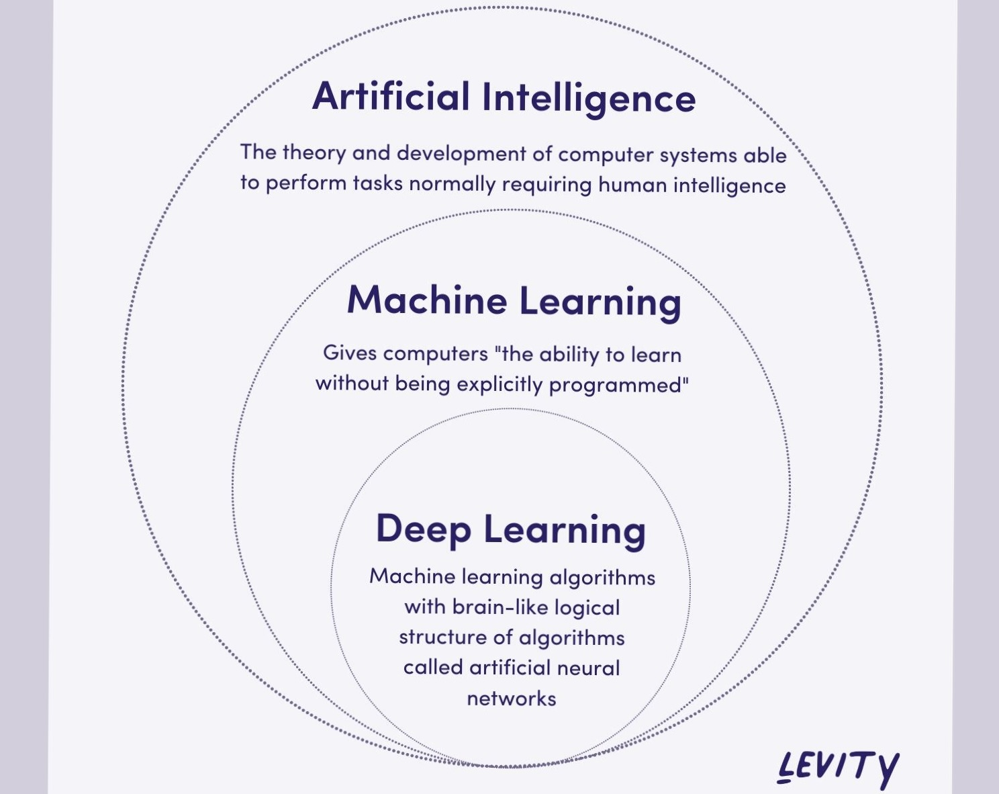
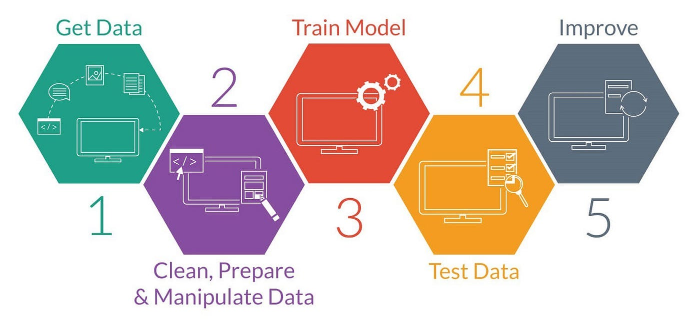
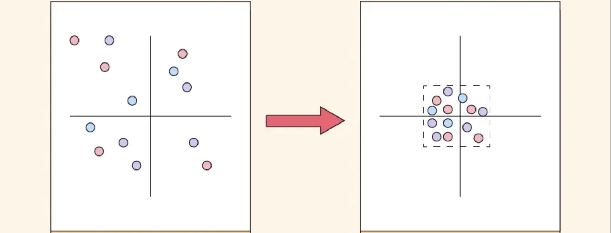
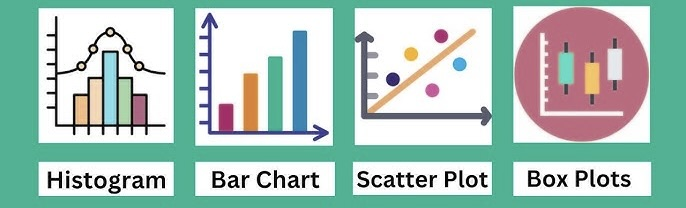

# Aprendizaje Automático Nivel 1

## Índice

1. [¿Qué es el Aprendizaje Automático?](#1-qué-es-el-aprendizaje-automático)
2. [Introducción y Objetivos de Aprendizaje](#2-introducción-y-objetivos-de-aprendizaje)
3. [Humanismo y ética de la IA](#3-humanismo-y-ética-de-la-ia)
4. [Datos](#4-datos)
    - CSV
    - Importación de datos
    - Limpieza
    - Estadística
    - Gráficos
5. [Transformación de datos](#5-transformación-de-datos)
    - Escalado
    - Codificación
    - Ingeniería de Características
6. [Tipos de Gráficos](#6-tipos-de-gráficos)
7. [Análisis de Datos](#7-preprocesamiento-del-análisis-de-datos)
8. [Narración de Datos](#8-narración-de-datos)


## 1) Qué es el Aprendizaje Automático

<kbd></kbd>

### ¿Qué?
El aprendizaje automático es una rama de la inteligencia artificial centrada en el desarrollo de algoritmos que permiten a las computadoras **aprender de los datos y mejorar su rendimiento con el tiempo sin estar programadas explícitamente para cada tarea.**

### ¿Cómo?
Los modelos se entrenan con datos históricos (de entrada) para identificar patrones y relaciones. Una vez entrenados, pueden hacer predicciones o tomar decisiones al introducir nuevos datos.

### ¿Por qué?
Automatiza los procesos de toma de decisiones y mejora continuamente el rendimiento, gestionando a menudo tareas complejas y grandes conjuntos de datos de forma más eficiente que los enfoques de programación tradicionales.

---

#### Ejemplo: Filtrado de correo no deseado

<kbd></kbd>

Al usar Gmail, Google filtra automáticamente los correos spam en una sección aparte o muestra una advertencia en la parte superior. Esto se debe a que Google ha desarrollado un filtro de spam que clasifica automáticamente los correos no deseados.
- **Recopilación de datos:** Recopilación de un amplio conjunto de datos de correos electrónicos etiquetados como "spam" o "no spam".
- **Extracción de características:** Extrae características de estos correos electrónicos que podrían ayudar a identificar el spam, como palabras clave, la dirección del remitente, la presencia de enlaces, etc.
- **Entrenamiento de algoritmos:** Crea un algoritmo que aprende las características de los correos spam a partir del conjunto de datos etiquetado.
- **Predicción:** Cuando llega un nuevo correo electrónico, el modelo entrenado lo analiza y predice si es spam.
- **Adaptación:** A medida que los usuarios se encuentran con tipos de spam nuevos, diferentes o en evolución, pueden proporcionar datos actualizados, y el algoritmo se adaptará reentrenándose con la nueva información, garantizando así su eficacia a lo largo del tiempo.

*Este es solo un ejemplo sencillo de cómo se puede utilizar el aprendizaje automático. En el ámbito médico, por ejemplo, un modelo entrenado con un gran número de resonancias magnéticas podría distinguir y predecir si un paciente tiene cáncer. De igual manera, en el ámbito empresarial, un modelo podría analizar datos de una acción específica para pronosticar si su precio subirá o bajará. Las posibilidades del aprendizaje automático son infinitas.*

## 2) Introducción y objetivos de aprendizaje

- Analizar el humanismo y la ética de la IA en el aprendizaje automático.
- Comprender los conceptos básicos del análisis de datos y la estadística.
- Aprender a gestionar y limpiar datos en formato CSV con Python.
- Familiarizarse con los tipos básicos de visualización y la narrativa de datos.

## 3) Humanismo y ética de la IA

La inteligencia artificial y el aprendizaje automático han evolucionado rápidamente en los últimos años y se están integrando cada vez más en la vida cotidiana. Modelos como ChatGPT o DALL-E generan texto, imágenes y música con una creatividad y precisión impresionantes. Los sistemas autónomos, como los asistentes robóticos y los coches autónomos, demuestran la capacidad de la IA para operar en entornos reales con mínima intervención humana.

**Principales Preocupaciones:**
- **Desplazamiento Laboral:** La automatización podría reemplazar a los trabajadores humanos en sectores como la manufactura, la atención al cliente y las áreas creativas.
- **Privacidad:** El uso de grandes cantidades de datos personales plantea importantes preguntas sobre la recopilación y el intercambio de datos.
- **Autenticidad:** Con la IA capaz de generar texto, imágenes y videos realistas, distinguir entre contenido real y artificial se vuelve un desafío.

Las consideraciones éticas en la IA son cada vez más urgentes. Equilibrar la innovación con la rendición de cuentas, la transparencia y la equidad es crucial para garantizar que la IA sirva al bien público en lugar de aumentar las desigualdades sociales.

Este es un tema amplio y muy fisiológico, y existen muchos recursos en línea para aprender más sobre humanismo y ética. Lo principal es reconocer estos valores y preocupaciones al desarrollar la IA.

## 4) Datos

Dado que no existe aprendizaje automático sin datos, es crucial comprender cómo se recopilan, procesan y utilizan eficazmente en los modelos de aprendizaje automático.

Los datos son la base del aprendizaje automático, ya que los modelos aprenden patrones y realizan predicciones a partir de la información proporcionada. Por lo tanto, es fundamental gestionarlos correctamente.

#### Archivos CSV

Existen tres tipos principales de datos:
- **Datos estructurados:** Organizados en tablas con relaciones claras
    - (Archivos CSV, bases de datos, hojas de cálculo)
- **Datos no estructurados:** Incluyen texto, imágenes, vídeos y archivos de audio; a menudo requieren técnicas de análisis avanzadas como el procesamiento del lenguaje natural (PLN) o la visión artificial.
- **Datos semiestructurados:** Se encuentran entre los estructurados y los no estructurados
    - (JSON o XML).

En esta presentación, y en la mayoría de los modelos, trabajaremos con archivos CSV, el formato de datos más común.

Los archivos CSV significan valores separados por comas, son populares porque son fácilmente legibles por programas y personas, tienen filas y columnas separadas por comas.


#### Importación de datos con Google Colab

Usaremos Google Colab (Jupyter Notebook basado en la nube) para mostrar todo el código. Google Colab está diseñado específicamente para el aprendizaje automático, por lo que no es necesario instalar bibliotecas específicas. También ofrece GPU y CPU gratuitas en la nube para ejecutar modelos. Así, cualquiera puede experimentar sin necesidad de un portátil potente.

Existen muchas maneras de importar datos, y el proceso varía según la fuente y el formato. Cada sitio web o plataforma tendrá instrucciones específicas para descargar o acceder a los datos, pero el objetivo principal es cargar el conjunto de datos en un DataFrame (df) de Pandas. Esto nos permite limpiar, analizar y manipular los datos de forma eficiente.

**Componentes del DataFrame:**

Queremos que nuestros datos estén en un DataFrame para poder acceder a:

- **X (características):** Las variables independientes utilizadas para las predicciones.
- **Y (variable objetivo):** La variable dependiente que queremos predecir.

**Fuentes de conjuntos de datos populares:**
- Kaggle
- Openml
- Búsqueda de conjuntos de datos de Google
- Repositorio de aprendizaje automático de UCI

Para estos ejemplos, utilizaremos el conjunto de datos Iris de Scikit-learn. Tenga en cuenta que Scikit-learn suele cargar los conjuntos de datos como objetos Bunch en lugar de archivos CSV. Para mantener la coherencia, trabajaremos con una versión CSV modificada para incluir valores faltantes, duplicados y valores atípicos.

Descargue este archivo y guárdelo en una carpeta organizada en Google Drive.

[Iris DataSet](datos/Iris.csv)

##### Ejemplo: Importar datos desde Google Drive en Colab

```python
from google.colab import drive
drive.mount('/content/drive')

import pandas as pd

# Reemplace 'path_to_file.csv' con su ruta de archivo real
df = pd.read_csv('/content/drive/MyDrive/path_to_file.csv')
```

### Limpieza de Datos

Ahora que hemos revisado nuestros datos y los tenemos en nuestro software, podemos observar algunos aspectos del conjunto de datos.

Los conjuntos de datos del mundo real nunca son perfectos; suelen presentar valores faltantes, valores atípicos y errores al imputarlos durante el proceso de recopilación de datos.

La limpieza de datos consiste en corregir o eliminar datos incorrectos, corruptos o incompletos. Este paso es esencial, ya que los datos incorrectos generan resultados incorrectos.

Por lo tanto, antes de crear modelos de aprendizaje automático, debemos asegurarnos de que nuestros datos sean legibles.

#### Pasos comunes de limpieza de datos:
- **Eliminar duplicados:** Elimine las filas duplicadas.
- **Eliminar valores atípicos:**
    - Elimine los puntos de datos significativamente mayores o menores que el resto de los datos.
    - Importante porque algunos valores pueden ser demasiado altos o demasiado bajos en comparación con el resto de los datos y distorsionar la información en su conjunto.
    - ¿Qué sucede si nuestro conjunto de datos es tan grande que no podemos revisar todos los valores manualmente?
        - En la próxima presentación, mostraré técnicas avanzadas para eliminar valores no deseados.

- **Gestionar datos faltantes:** Identifique las filas con valores faltantes (NaN) o cero, y elimínelas o complételas.

##### Ejemplo: Código de limpieza de datos en Colab

```python
# Eliminar filas duplicadas
df = df.drop_duplicates()

# Eliminar filas con valores faltantes
df = df.dropna()

# Alternativamente, complete los valores faltantes (por ejemplo, utilizando la media de la columna)
# df.fillna(df.mean(), inplace=True)
```

### Estadística en la Limpieza de Datos

La estadística nos ayuda a comprender la estructura y la calidad de los datos antes de utilizarlos en modelos de aprendizaje automático.

Mediante la aplicación de métodos estadísticos, podemos detectar errores, identificar valores faltantes, gestionar valores atípicos y garantizar la consistencia de los datos.

| **Estadística** | **Significado** | **Ejemplo de uso** |
|--------------------------|-------------------------------------------------|---------------------------------------------------|
| **Media** | Valor promedio de una columna | Completar valores faltantes en datos con distribución normal |
| **Mediana** | Valor medio (menos afectado por valores atípicos) | Completar valores faltantes en datos asimétricos |
| **Moda** | Valor más común en una columna | Completar valores faltantes en datos categóricos |
| **Desviación estándar** | Medida de la dispersión de los datos respecto a la media | Identificar datos muy dispersos |
| **Mín./Máx.** | Valores mínimo y máximo | Detectar posibles errores en los datos |
| **Percentiles (25 %, 75 %)** | Dispersión de la distribución | Detectar valores atípicos |


### Funciones comunes de Pandas para aprendizaje automático

#### Importación e inspección de datos

- **`pd.read_csv("file.csv")`**: Lee un archivo CSV en un DataFrame.

- **`df.head()`**: Muestra las primeras filas del DataFrame.

- **`df.tail()`**: Muestra las últimas filas del DataFrame.

- **`df.info()`**: Ofrece una descripción general de los tipos de datos y los recuentos no nulos.

- **`df.describe()`**: Devuelve estadísticas descriptivas para columnas numéricas.

#### Gestión de valores faltantes

- **`df.isnull().sum()`**: Muestra el recuento total de valores faltantes por columna.

- **`df.dropna()`**: Elimina filas (o columnas) con valores faltantes.

- **`df.fillna(value)`**: Completa los valores faltantes con un valor o método determinado (`method='ffill'`).

### Limpieza y transformación de datos

- **`df.drop_duplicates()`**: Elimina filas duplicadas.

- **`df.rename(columns={"old_name": "new_name"})`**: Renombra columnas.

- **`df['col'].astype(new_dtype)`**: Convierte una columna a un tipo de dato específico.

- **`df['col'].apply(function)`**: Aplica una función personalizada a cada elemento de una columna.

- **`df.loc[row_indexer, col_indexer]`**: Selecciona datos por etiqueta.

- **`df.iloc[row_indexer, col_indexer]`**: Selecciona datos por posición entera.

#### Ingeniería de Características

- **`df['new_col'] = df['col1'] + df['col2']`**: Crea una nueva característica combinando columnas existentes.

- **`pd.get_dummies(df['categorical_col'])`**: Aplica codificación one-hot a una variable categórica.

- **`df['col'].map(mapping_dict)`**: Reemplaza los valores de una columna mediante un mapa de diccionario.

#### Análisis Exploratorio de Datos (EDA)

- **`df['col'].value_counts()`**: Cuenta las ocurrencias de cada categoría en una columna.

- **`df.corr()`**: Calcula la correlación por pares entre columnas.

- **`df.describe(include='all')`**: Proporciona estadísticas descriptivas para columnas numéricas y de objeto.

#### Aprendizaje automático

- **`X = df.drop('target', axis=1)`**: Divide las características de la columna de destino.

- **`y = df['target']`**: Establece la columna de destino por separado.

- **`train_test_split(X, y, test_size=0.2, random_state=42)`**: Divide los datos en conjuntos de entrenamiento y prueba (de scikit-learn).


## 5) Transformación de Datos

La transformación de datos convierte los datos sin procesar a un formato más adecuado para los modelos de aprendizaje automático. Los procesos principales incluyen:

### Escalado

El escalado es crucial para los algoritmos que se basan en métodos basados ​​en distancias o gradientes. Cuando las características tienen diferentes escalas, algunas pueden predominar sobre otras. Las técnicas comunes incluyen:

Por ejemplo, considere dos características:
- ***Horas***: Los valores oscilan entre [0.0 y 24.0].
- ***Metros***: Los valores oscilan entre [500 y 1000].

En este escenario, ambas características son igualmente importantes, pero la característica ***metros*** tiene una escala mucho mayor en comparación con la característica ***horas***. Esto significa que, al calcular distancias (o gradientes), la característica ***metros*** tendrá un impacto desproporcionadamente grande en el resultado. Esto podría provocar que el modelo otorgue mayor importancia a la característica metros y genere predicciones sesgadas.

- **Estandarización (Escala de puntuación Z):**
    - Se utiliza cuando los datos se distribuyen normalmente o para modelos lineales/redes neuronales.
    - Transforma los datos para que cada característica tenga una media de 0 y una desviación estándar de 1.

- **Normalización Mín-Máx:**
    - Escala los datos a un rango fijo, típicamente de 0 a 1.
    - Útil para algoritmos que se basan en métricas de distancia.

- **Escalamiento robusto:**
    - Utiliza la mediana y el rango intercuartil, lo que lo hace menos sensible a los valores atípicos.

<kbd></kbd>


### Codificación de Variables Categóricas

Los algoritmos de aprendizaje automático no pueden procesar datos categóricos directamente; los modelos requieren una entrada numérica, por lo que los datos categóricos (p. ej., "Rojo", "Verde", "Azul") deben codificarse en números.

Aquí hay dos métodos comunes:

- **Codificación de Etiquetas:**
    - Convierte cada categoría única en un entero.
        - *Ejemplo:* {"Rojo": 0, "Verde": 1, "Azul": 2}
    - Útil cuando las categorías están ordenadas o jerarquizadas.
    - *Nota:* Esto puede implicar un orden entre categorías (p. ej., 0 < 1 < 2), lo cual no siempre es significativo.

- **Codificación One-Hot:**

    - Crea nuevas columnas binarias (variables ficticias) para cada categoría.
    - Mantiene los datos en un formato que muchos algoritmos de aprendizaje automático manejan bien (especialmente los modelos basados ​​en árboles).
    - *Nota:* Esto aumenta el número de características, pero evita implicar ningún orden.

<kbd></kbd>


### Ingeniería de Características (Avanzada)

La ingeniería de características implica crear nuevas características o modificar las existentes para mejorar el rendimiento del modelo. Este proceso puede revelar patrones ocultos que las características más simples podrían no detectar y mejorar la capacidad predictiva del modelo. A menudo se considera un arte, no una ciencia.

- **Combinación de Características:**
    Si tiene "ingresos anuales" y "tamaño familiar", podría crear "ingresos por persona" como nueva característica.
- **Extracción de Componentes de Fecha/Hora:**
    Desglose una fecha y hora (ej.: "2025-01-04 14:30:00") en características de "año", "mes", "día" y "hora".


## 6) Tipos de Gráficos

Al analizar datos, las visualizaciones se utilizan para transformar números sin procesar en datos más legibles, identificar anomalías y comparar variables rápidamente. En el análisis de datos, seleccionar el tipo de gráfico adecuado es importante para ilustrar eficazmente la historia que cuentan los datos.

A continuación, se presentan varios tipos comunes de gráficos con sus características clave y cuándo se utiliza cada uno de ellos de manera más apropiada.

1. Gráficos de Barras
    - Los gráficos de barras comparan categorías discretas mediante barras rectangulares.
        - Ideales para comparar cantidades entre diferentes grupos.
    - La altura de cada barra representa el valor de la categoría correspondiente, lo que facilita la comparación de las diferencias a simple vista.

2. Gráficos de Líneas
    - Los gráficos de líneas muestran tendencias durante un período continuo, conectando puntos de datos individuales con una línea.
        - Perfectos para el seguimiento de cambios a lo largo del tiempo.
    - Proporcionan una representación visual clara de las tendencias, lo que permite ver patrones como movimientos ascendentes o descendentes en los datos.

3. Diagramas de dispersión
- Los diagramas de dispersión muestran la relación entre dos variables numéricas mediante la representación de puntos en un plano cartesiano.
    - Ideales para explorar posibles correlaciones o relaciones, como la relación entre la inversión publicitaria y las ventas.
    - Útiles para identificar conglomerados, tendencias o valores atípicos que puedan indicar casos especiales o errores.
- Cada punto representa una observación individual de los datos, lo que permite visualizar cómo una variable puede afectar a otra.

4. Histogramas
- Los histogramas representan la distribución de una sola variable numérica agrupando los datos en intervalos.
    - Útiles para revelar la forma de la distribución de los datos (p. ej., normal, asimétrica).
- Los datos se dividen en rangos (intervalos) y la altura de cada barra refleja el número de puntos dentro de ese rango.

5. Diagramas de caja (diagramas de caja y bigotes)
- Los diagramas de caja resumen la distribución de los datos mostrando la mediana, los cuartiles y los posibles valores atípicos.
    - Son útiles para identificar valores atípicos y comprender la dispersión general y la tendencia central de los datos.
- Ofrecen un resumen conciso del conjunto de datos, destacando tanto la tendencia central como la variabilidad de los datos.

6. Mapas de calor (Avanzado)
- Los mapas de calor utilizan gradientes de color para representar los valores de los datos en una matriz, lo que facilita la comprensión de patrones complejos.
    - Son eficaces para visualizar matrices de correlación o distribuciones de frecuencia en múltiples categorías.
- La variación en la intensidad del color ayuda a indicar la magnitud de los valores de los datos, proporcionando una pista visual inmediata de tendencias y anomalías.

<kbd></kbd>

## 7) Análisis/Preprocesamiento de Datos

Todo lo que acabo de mencionar se enmarca en la etapa de Análisis/Preprocesamiento de Datos del Aprendizaje Automático.

**Recopilación de Datos:**
- Recopilación de datos ya realizada: simplemente busque un conjunto de datos y cárguelo en su espacio de trabajo.

**Análisis Exploratorio de Datos (EDA)**
- Este es el proceso de comprender sus datos, teniendo en cuenta su objetivo. ¿Qué debe hacer con ellos para tener éxito? Utilice visualizaciones y estadísticas descriptivas para comprender sus datos.
- ¿Cuáles son los tipos de datos?
- ¿Cuáles son las estadísticas básicas del conjunto de datos?

**Visualización y Gráficos en EDA**
Los gráficos nos ayudan a comprender las relaciones y los patrones que son difíciles de ver simplemente como números.
- Limpieza de Datos
    - ¿Hay duplicados?
    - ¿Hay valores atípicos?
    - ¿Hay valores faltantes?
    - Gestión de Datos Faltantes
- Transformación de Datos
    - ¿Qué características escalamos?
    - ¿Qué características categóricas necesitamos codificar?


## 8) Narrativa de Datos

Este es un avance de la etapa de Narrativa de Datos, omitiendo la etapa de Modelado, que abordaremos la próxima semana.

Tras completar el preprocesamiento y el modelado, el siguiente paso es presentar eficazmente los hallazgos.

La narrativa de datos es el puente entre los datos sin procesar y la información procesable.

Este importante aspecto del análisis de datos es el paso final del aprendizaje automático, garantizando una comunicación que atraiga a la audiencia y oriente sus decisiones. En otras palabras, se trata de hacer que los datos sean significativos, integrándolos en una narrativa clara y fácil de entender.

## Enlaces adicionales
